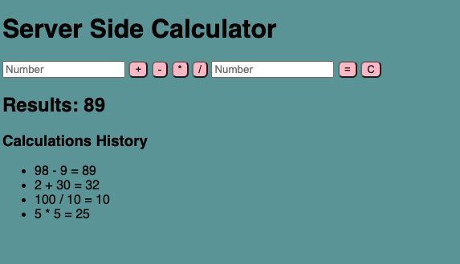

# Jquery Server Side Calculator

## Description

Calculator application where user can input two values and select out of 4 different mathematical operators to perform calculations.

When '=' button is clicked, result will render under Calculations History. If needed, user can click on 'C' button to clear the fields. The most recent result will display right below user input fields.

## Screen Shot

## Pre-requisites
Link to software that is required to install the app (e.g. node).
* Node.js
* List other prerequisites here

## Installation
1. Create html 
2. Run server to open up application

## Usage
1. Input values onto input fields
2. Select operator
3. Click on = to calculate

## Built With

HTML, CSS, JavaScript, Jquery

## Acknowledgement
Thanks to [Prime Digital Academy](www.primeacademy.io) who equipped and helped me to make this application a reality. 

